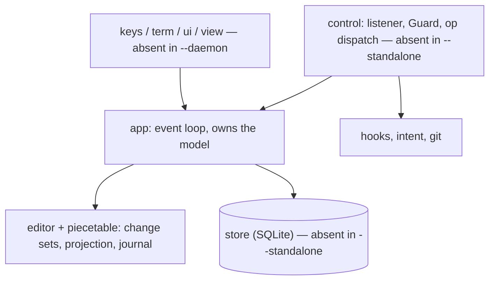
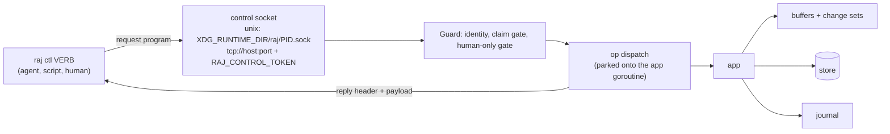
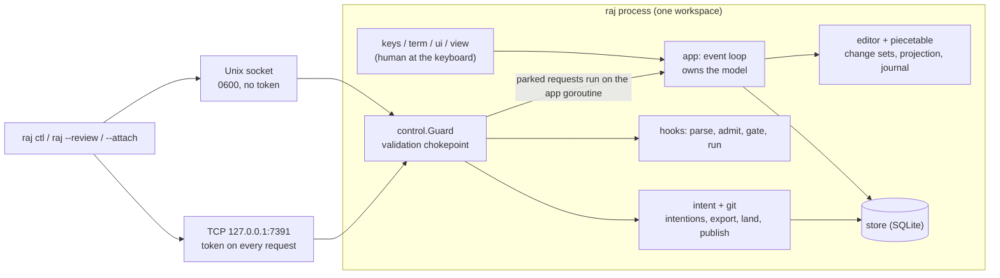
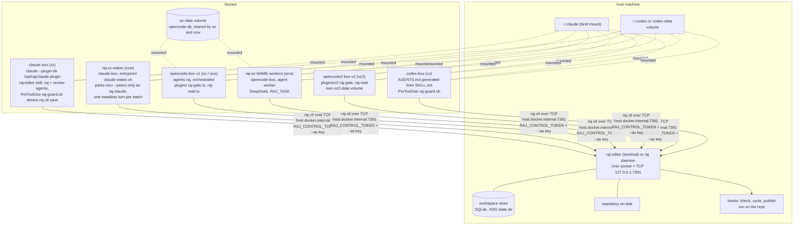
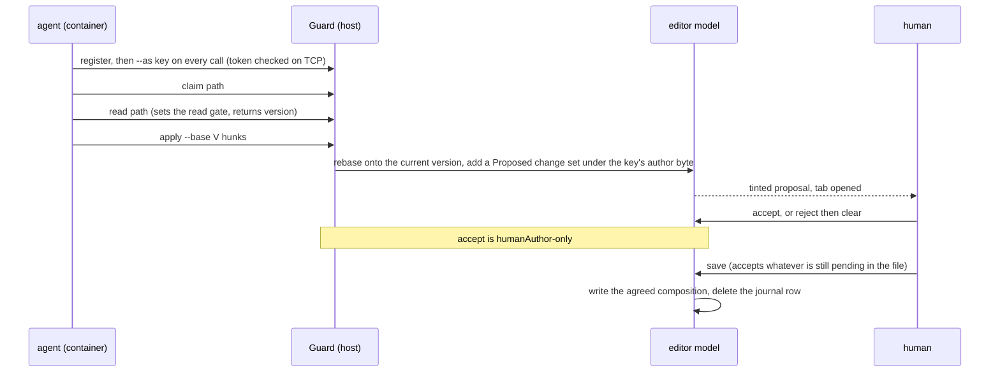

# raj architecture

Date: 2026-09-28 · HEAD f6755fc6 · Describes the tree as it is, not as intended. §6 lists where specs, comments and code disagree without choosing between them.

## 1. What raj is: a text editor with daemon modes

raj is a terminal text editor. Everything else hangs off one fact: the
same binary (`cmd/raj/main.go`) runs in one of four modes, and the mode
decides which parts exist at all.

| mode | what exists | what does not |
| --- | --- | --- |
| `raj [root]` | the interactive editor: one workspace, its store and session, the UI, and a control listener agents reach with `raj ctl` | — |
| `raj --standalone FILE` | one buffer and the UI; for use as `$EDITOR` | no workspace, no session, no store rows, no control listener, so no agents |
| `raj --daemon` (`raj daemon run`) | the workspace, store, session, buffers, journal, hooks and the control socket, serving clients and agents | no UI, no keyboard; a human reaches it through an attach client |
| `raj --attach` / `--phone` / `--name N` | a UI client that renders the daemon's workspace locally; `--phone` is the phone profile and implies `--attach`; `--name` keeps this client's own saved tab view | no workspace of its own: buffers, change sets and store stay in the daemon |

### Layer map

## 1a. `raj ctl` and its verbs

`raj ctl` is the product's API: every agent, script and attach client
speaks it (`internal/control`, verb list and dispatch in `cli.go`).

Verb families (from `raj ctl` usage):

- **inspect**: list, buffers, status, read, ls, groups, proposals, deletions, rmdirs, diff, version, who, whoami, token, search, lsp, git
- **navigate**: open, goto, reveal, close, claim
- **mutate** (proposals, attributed): apply, edit, dump/patch, mkdir, rename, delete, rmdir, revert
- **decide**: accept, reject, clear
- **identity and mail**: register, whoami, state, send, recv
- **intentions and git**: intent new / add / remove / list / show / export / materialise / prove / publish
- **hooks**: hook run / list / show / log / ps / cancel; authoring (add, enable, disable, off)

**Agent-callable vs human-only** — this boundary is architecture. Human
only: `save`, `land`, `delete --approve`, `rmdir --approve`,
`intent publish --approve`, hook authoring, and the `HumanOnly` builtin
leaves (`git.blob`, `git.tree`, `git.commit`, `git.note`), which refuse an
agent caller even on a hook with `agent = 1`. Everything else an agent
may call, gated by its claim set.

**Wire shape.** Each call is one op: a request header, then a reply
header and payload. A header is itself a program: `'R'`, a version, then
one op per non-zero field (`internal/control/header.go`). Unknown fields
are skipped, so old and new builds interoperate; `raj ctl` also warns when
its build differs from the editor's. Request fields use 0x01–0x1f,
response fields 0x20–0x7f. **The 0x01–0x7f argument range is full**
(`hLand` 0x7e, `hMessageFrom` 0x7f): a new field needs a freed code, a
nested field with its own sub-codes, or a new allocation rule (TODO.md).
The `0x80`-and-above-is-a-verb rule is a *program* rule (`run --prog`,
where `control/prog.go` passes a known set); a header is decoded with no
known set, so an unknown header code at or above `0x80` is skipped, not
read as a verb.

## 2. Workspaces

A **workspace** is one editor bound to a root: the root directory (or, in
the multi-root groundwork, an ordered set of roots with the first as
primary, `internal/workspace`), together with everything scoped to it — its
store, its session, its open buffers and their change sets, its hooks, its
participants and their keys, and its intentions. One raj process serves one
workspace; two editors on the same repository are two workspaces.

What is per-workspace, and where it lives:

| thing | scope | where |
| --- | --- | --- |
| store | one SQLite file per root set, in the XDG state dir (`internal/store`, schema v10) | host disk |
| session, cursor positions, `workspace` settings | per workspace (`user` settings are shared; `client` settings are per attach name) | store: `session`, `positions`, `settings` |
| unsaved-buffer journal | one row per dirty buffer, deleted on save | store: `journal` |
| hook registry | per workspace; authored only by the local human | store: `hooks` (`tree`, `detach`, `params` columns) |
| intentions and their exports | per workspace | store: `intentions`, `intent_exports` |
| mail | durable queue keyed by recipient identity | store: `mail` |
| participants and keys | per running editor, **in memory** (see §6) | `internal/control/participant.go` |
| claim sets, dump snapshots | per participant, in memory, reset on restart | `internal/control` |
| daemon record (pid, socket, tcp, token, label, roots) | one per root set, written 0600 | state dir, `internal/daemon` |

**The two trees a hook runs against.** A hook row carries `tree`:

- `tree=workspace` runs the command in the saved root itself, and only when
  the workspace is ready — nothing unsaved and no pending change set it
  would miss. It sees exactly what is on disk. The `cycle` and `publish`
  hooks use it.
- `tree=projected` (the default) runs in a scratch tree materialised from the
  live composition: the git worktree at HEAD with the buffers overlaid as
  **accepted and proposed** text (`ProjectionWithProposed`,
  `internal/control/materialise.go`). The run is stamped with HEAD and a
  digest of `git status --porcelain`, and the scratch tree is removed after
  the run unless the hook is detached.

The split exists because the two questions differ. "Does what the agents
proposed build and pass?" has to be asked before anyone accepts or saves,
so it runs against text that is only in the buffers. "Ship what the human
agreed to" must never see unagreed text, so it runs only on the saved root
once nothing is pending. `exec --projected` is the ad-hoc form of the first.
Projected runs materialise the primary root only; a multi-root projected run
is refused by name.

**Finding workspaces.** `raj ctl list` lists running editors, one
`socket root` pair per line. It lists the Unix socket directory
(`XDG_RUNTIME_DIR/raj/PID.sock`, else `TMPDIR/raj-UID/`) and asks each
socket what root it holds, so it finds nothing from a container reaching
the editor over TCP. `raj daemon list` lists daemons from their state
records instead, with the `--workspace` label.

## 3. Components and topology

### Component diagram

### Containers of harnesses

Grounded in `harness/Dockerfile.*` and `harness/harness-functions.sh`.
Every image is `node:22-slim` plus git, ripgrep and jq, a linux `raj`
binary at `/usr/local/bin/raj`, user `oc`, `WORKDIR /work`, and
`RAJ_CONTROL_ADDR=tcp://host.docker.internal:7391`.

What crosses the boundary, and over what:

- **One channel: TCP to the host's control port.** Every container reaches
  the editor only as `raj ctl` over `tcp://host.docker.internal:7391`, with
  the shared `RAJ_CONTROL_TOKEN` on every request. The Unix socket cannot
  cross: a bind-mounted socket inode has no listener behind it
  (`internal/control/addr.go`). `harness-functions.sh` deliberately passes
  no `--add-host`: on Docker Desktop `host.docker.internal` already reaches
  host loopback.
- **Identity rides on the channel, not the container.** A container is not
  a participant; a key is. Each agent registers (or is pinned, like
  `raj-claude` for the waker and `deepseek-NAME` for workers) and passes
  `--as` on every call. The token says "may talk to this editor"; the key
  says who is talking.
- **Paths are translated, not shared.** No harness function mounts the
  repository. `raj ctl` resolves the container's paths to the editor's roots
  on connect (`ResolveRoots`, `RAJ_ROOT_MAP`), and file content moves only
  as protocol frames.
- **Host mounts that do exist:** `~/.claude` (sessions, login, and the
  waker's log and kill switch) and `~/.codex` or the `codex-data` volume are
  mounted into **every** container `_oc_docker` starts, not only the one
  that uses them, and every provider API key is passed to every container
  as environment. `oc-data` holds v1's opencode database, shared by the
  primary session and the workers; v2 uses `oc2-data`.

What a container cannot reach: the store (a host SQLite file, reached only
through verbs), the host filesystem outside the mounts above, the git
repository, and host execution. `exec`, hook authoring, hook cancel and the
on/off panic switch are refused over TCP by name (`control.go`); a hook an
agent may call (`--agent`) runs on the host, but only as the human wrote it.

Host-side: the editor or daemon, the store, the repository, hooks and
`scripts/raj-cycle.sh`, and the image builds (`bldraj`, `bldoc`, `bldoc2`,
`bldclaude`, `bldcodex`). Container-side: the agent runtimes, their plugins
and guards, the waker, and the `raj ctl` client.

## 4. Two journeys

### An agent change the human accepts

An agent's own `save` is stopped three times over: the harness guard
(the Claude and Codex PreToolUse `raj-guard.sh`, opencode's `raj-gate.ts`)
and then the editor, which refuses a save while proposals are pending and
refuses `accept` from anyone but a human.

### A wave going out as a merge request

1. Work is filed under a task (`RAJ_TASK`, pinned at register), and an
   intention names a set of groups over a base ref (`raj ctl intent new
   --ref BASE --task T`, then `add`, `show`).
2. `intent prove` materialises the intention alone over its base and runs
   the `check` hook against it.
3. The human's land gesture accepts and saves the wave; `intentLand`
   (`internal/app/land.go`) exports the reviewed composition as **one**
   commit parented on the base head and moves `raj/baseline` to it. The
   worktree, index and HEAD are untouched, and a re-land of an unchanged
   tree writes nothing.
4. `intent publish` records a pending **Publish** proposal
   (`internal/intent/publish.go`) with everything pinned: branch
   `raj/wave-SLUG`, remote and its URL, base SHA, commit, and the publish
   hook's path, content hash and argv.
5. `intent publish --approve`, which only a human may run, re-checks every
   pin and refuses on drift, then runs the publish hook
   (`examples/hooks/publish-single.sh`, `tree=workspace`). The hook pushes
   the branch and prints or creates the merge request: a GitHub URL, an
   opt-in `gh pr create`, or GitLab push options.

## 5. Boundary rules

**Imports**, as observed in the tree (no test enforces them; see §8):

- `piecetable`, `store`, `git` and `workspace` import no other `raj/internal`
  package. `store` keeps domain values in plain text columns and does not
  import `hooks` or `intent`, which is why it repeats `"projected"`.
- `hooks` imports only its own `builtin`. `intent` imports `git` and `store`.
- `control` imports `git`, `hooks`, `intent`, `prog`, `safe`, `syntax` and
  `term`, but not `app`, `editor` or `piecetable`. It reaches the document
  through the `BufferHost` interface, which `app` implements.
- Nothing in `internal/` depends on `harness/`, `plugins/` or `scripts/`.

**The agent/human trust line:**

- Human-only gestures: `accept`, `save`, `intent publish --approve`, and
  hook authoring. `Guard.humanAuthor` admits the local keyboard row or a
  joined human client, and refuses an agent, an anonymous connection and
  author 0 (the file as loaded).
- Agents write only proposals, only inside their claim set, only after a
  read, and always under their key's author byte.
- The harness guards are a courtesy layer; the editor's refusal is the rule.

**Host-side versus container-side:**

- TCP requires the token. The Unix socket relies on filesystem permissions
  (0700 directory, 0600 socket), the same boundary as the user's shell.
- Refused over TCP: `exec`, hook authoring, hook cancel, the panic switch.
- A command runs on the host only as a hook the human wrote. An agent runs
  its own tests in its own container.

## 6. Where the specs, comments and code disagree

Listed, not decided. These turned up while writing this file; it was not an
exhaustive sweep.

- `participant.go` says attribution "can outlive the process because the
  table is small enough to persist", but the store has no participants
  table: keys and author bytes live in memory. Only mail survives a restart,
  keyed by identity.
- The `store` package doc lists "session, per-file cursor positions and
  settings"; the schema also holds the journal, hooks, mail, intentions and
  exports.
- `skills/raj-editor/SKILL.md` tells the user to pass
  `--add-host=host.docker.internal:host-gateway`; `harness-functions.sh`
  leaves it out on purpose and says it breaks an editor bound to loopback.
- `harness-functions.sh` says `bldraj` rebuilds "all three harness images".
  There are four Dockerfiles, `bldraj` builds none of them, and `bldall`
  leaves out `bldoc2`.
- The `publish-single.sh` header describes building its own commit from the
  working tree on disk; `intent/land.go` says "publish only pushes a commit
  that already exists". Neither says which commit ships when both apply.
- Every container gets `~/.claude`, `~/.codex` and every provider key, not
  only the harness that needs them. No doc says whether that is intended.

## 7. Vocabulary

| term | means |
| --- | --- |
| workspace | one editor bound to a root (set); the scope of store, hooks, participants and intentions |
| root | a workspace directory; the first of several is the primary |
| buffer | an open document; it may differ from disk |
| change set / group | one attributed edit, Proposed, Accepted or Rejected |
| proposal | a Proposed change set, or a pending deletion or publish |
| composition / projection | the text a set of change-set states yields: *accepted* is what save writes, *with proposed* is what the editor shows |
| projected tree | a scratch checkout: HEAD plus the buffers' accepted and proposed text |
| workspace tree | the saved root, usable only when nothing is unsaved or pending |
| author | the opaque byte a piece of text is tagged with; 0 is the file as loaded, 1 the local human |
| participant | a durable identity mapped to an author byte, of kind human or agent |
| key | an agent's identity string (`raj-…`, `deepseek-w1`), passed as `--as` |
| token | `RAJ_CONTROL_TOKEN`, the shared secret for the TCP listener |
| claim set | the paths a participant may write |
| mail / mailbox | `send`/`recv` between participants, durable per identity |
| waker | what turns mail into a model turn: `raj-mail.ts` for opencode, `claude-waker.sh` for Claude |
| hook | a human-authored host command that agents may be allowed to run |
| intention | a named, owned set of groups over a base ref |
| wave | the work filed under one task; it lands as one commit and publishes as one branch |
| land | export a wave as one commit and move `raj/baseline` |
| publish | push that commit as `raj/wave-SLUG` and open a merge request, on human approval |
| harness | a container image plus launcher that runs an agent runtime against a host raj |
| daemon | a headless raj host (`raj daemon start`), found by its state record |

## 8. Deliberately deferred or absent

- **Multi-root workspaces:** `workspace.Roots` holds several roots, but
  projected hook runs refuse anything outside the primary root.
- **Persistent participants:** see §6.
- **Stacked publishes:** only the `single` strategy exists (one commit, one
  branch, one merge request).
- **An import-boundary check:** the rules in §5 are observed, not enforced
  by a test.
- **Automatic Codex hook trust:** a headless container cannot trust its
  PreToolUse guard, so the first run needs `/hooks` or managed hooks.
- **An orchestrated agent on opencode v2:** v2 has no `--agent`, so `oco2`
  refuses.
- **Not grounded here:** the review UI (`raj --review`, `internal/review`)
  and the attach/phone clients are in the layer map but have no diagram, and
  the specs under `docs/` were not swept for disagreements.
